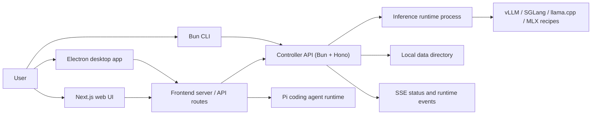
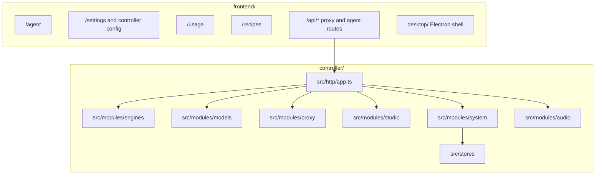

# Local Studio

Local Studio is a local-first workstation for running, managing, and using
self-hosted LLM backends. One machine can launch models, watch GPU/runtime
state, chat with OpenAI-compatible endpoints, and run agent sessions against
local or remote controllers.

It is built from three modules that share one controller API:

- [`controller/`](controller/README.md) — Bun/Hono backend. Owns model lifecycle
  (launch, evict, recipes, downloads, runtime process coordination), an
  OpenAI-compatible proxy (chat, models, tokenization, audio), system state
  (GPU metrics, logs, usage, settings, SSE), and controller integrations.
- [`frontend/`](frontend/README.md) — Next.js 16 + React 19 UI and the macOS
  Electron desktop shell. Hosts `/agent` (Pi coding agent runtime), settings,
  usage, recipes, logs, and the browser-facing API routes.
- [`cli/`](cli/README.md) — Bun CLI for checking and operating a controller from
  a terminal, with headless commands and an interactive TUI.

## What is a controller?

A controller is the backend process the UI and CLI talk to — the Bun/Hono
server in `controller/`. You can run one locally or point the frontend at a
remote controller on a GPU host. The controller owns model lifecycle, the
OpenAI-compatible proxy, system state, and SSE event streams.

## Architecture





## Quick start

Prerequisites: Bun 1.x (controller, CLI), Node.js 20+ and npm (frontend),
Python 3.10+ on `PATH` (`uv` strongly recommended; engine installs fall back to
pip), Git. vLLM/SGLang serving on Linux needs NVIDIA driver + CUDA; Apple
Silicon uses the MLX backend.

Run the preflight check first (toolchain, ports, directories, network):

```bash
npm run doctor
```

Start the controller (listens on `127.0.0.1:8080`, data dir + SQLite created
automatically, model weights in `LOCAL_STUDIO_MODELS_DIR`, default `/models`):

```bash
cd controller && bun install && bun src/main.ts
```

Start the frontend in a second terminal, then open
<http://localhost:3000/setup>:

```bash
cd frontend && npm ci && npm run dev
```

`npm ci` runs a postinstall patch against `@earendil-works/pi-ai`. If that step
prints a warning, agent streaming may misrender. The setup wizard walks through
choosing a models directory, installing an engine, downloading a model,
launching it, and benchmarking. Engine installs (vLLM/SGLang/MLX) land in
`<data dir>/runtime/venvs/<backend>-latest`.

Optional CLI:

```bash
cd cli && bun install && bun src/main.ts status
```

## Agent runtime

The agent surface lives at `/agent` in the frontend. It uses
`@earendil-works/pi-coding-agent` through the frontend runtime rather than
shelling out to a separate agent process for normal turns. Agent skills and
extensions are loaded by the frontend runtime and surfaced in the session UI.
Agent file operations are local-only, stored under `data/agentfs`.

## Runtime backends

Recipes launch through the controller runtime layer. Wired backend families:

- `vllm` — vLLM server recipes through configured/discovered/system/Docker/bundled targets.
- `sglang` — SGLang `launch-server` recipes through configured or discovered Python targets.
- `llamacpp` — llama.cpp `llama-server` recipes for GGUF models.
- `mlx` — MLX `mlx_lm.server` recipes for Apple Silicon.

Runtime target discovery is surfaced in Settings; selections persist in the
controller data directory.

## Production

Build the frontend, then serve it with the standalone server:

```bash
cd frontend && npm run build && npm run start
```

`npm run start` launches the standalone server (`scripts/start-standalone.mjs`).
Never use plain `next start` — it breaks SSE streaming. The controller runs the
same way in production as in development: `bun src/main.ts`.

## Remote / LAN deployment

The controller binds `127.0.0.1` by default. Binding a non-loopback host (e.g.
`LOCAL_STUDIO_HOST=0.0.0.0`) requires `LOCAL_STUDIO_API_KEY` — startup throws
without it. On a trusted LAN you may instead set
`LOCAL_STUDIO_ALLOW_UNAUTHENTICATED=true` to opt out of authentication.

Point the frontend at a remote controller with `BACKEND_URL` or
`NEXT_PUBLIC_API_URL` (default `http://localhost:8080`). The CLI uses
`LOCAL_STUDIO_URL`.

Remote deployment is handled by `scripts/deploy-remote.sh`. Configure
`.env.local` first (see `.env.example`):

```bash
REMOTE_HOST=192.168.x.x
REMOTE_USER=username
REMOTE_PATH=/home/user/project
REMOTE_URL=https://your-domain.example
```

```bash
./scripts/deploy-remote.sh controller   # sync + build + restart controller
./scripts/deploy-remote.sh frontend     # sync + build + restart frontend
./scripts/deploy-remote.sh status       # inspect remote processes
```

Local daemon helpers: `./scripts/daemon-start.sh`, `daemon-status.sh`,
`daemon-stop.sh`.

## Validation

```bash
npm run check        # contracts + structure + frontend quality + controller/cli typecheck
npm run test:e2e     # controller integration + frontend e2e
```

The configured pre-push hook (`.githooks/pre-push`) checks conventional commits
and runs the frontend quality gate (`npm --prefix frontend run check:quality`)
before pushing.

## Releases

Releases are automated. Pushing conventional commits to `main` triggers the
`release.yml` workflow, which runs semantic-release (`release.config.cjs`): it
analyzes commits since the last tag, cuts the next tag (`feat` → minor, others
→ patch, breaking → major), and publishes a GitHub Release with generated notes.
There is no npm publish (private monorepo, protected `main`). Do not tag by hand.

## Contributing

Contributions should be small, focused, and easy to review. Start from the
latest `main`, one logical change per branch, no formatting-only rewrites, no
secrets or build artifacts. Run `npm run check` (and `npm run test:e2e` for
behavior changes) before opening a PR; include a concise summary, the validation
commands you ran, and screenshots for UI changes. See AGENTS.md for the full
code standards an agent (or contributor) must follow.

## License

See [LICENSE](LICENSE).
