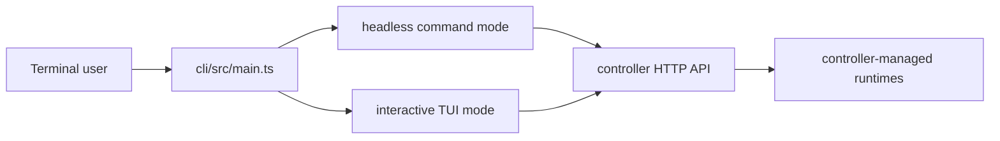

# CLI

`cli/` is the Bun command-line client for a Local Studio controller. It is useful for quick status checks, model lifecycle commands, and terminal dashboards without opening the frontend.

## What It Does

- Reads status and GPU information from a controller.
- Lists recipes and configuration.
- Launches and evicts models.
- Uses controller APIs, so runtime support follows the connected controller: vLLM, SGLang, llama.cpp, MLX, and configured recipe command overrides.
- Provides an interactive terminal UI and headless commands.

## What Is In Use

- Bun runtime.
- TypeScript source compiled with `bun build`.
- Direct HTTP calls to the controller API.

## Architecture



## Prerequisites

- Bun 1.x.
- A reachable controller. The default URL is `http://localhost:8080`.

## Commands

```bash
bun install
bun src/main.ts status
bun src/main.ts gpus
bun src/main.ts recipes
bun src/main.ts config
bun src/main.ts metrics
bun src/main.ts launch <recipe-id>
bun src/main.ts evict
bun src/main.ts help
```

Interactive mode:

```bash
bun src/main.ts
```

## Configuration

- `LOCAL_STUDIO_URL`: controller base URL. Defaults to `http://localhost:8080`.

The CLI does not discover local runtimes itself. It asks the connected controller for status, recipes, model lifecycle actions, and metrics.

## Development

```bash
bun run typecheck
bun run lint
bun run build
bun run check
```

The build command emits the compiled `local-studio` CLI binary.

## Where To Look

- `src/main.ts`: entrypoint.
- `src/headless.ts`: headless commands.
- `src/api.ts`: controller HTTP client.
- `src/views/`: interactive TUI views.
