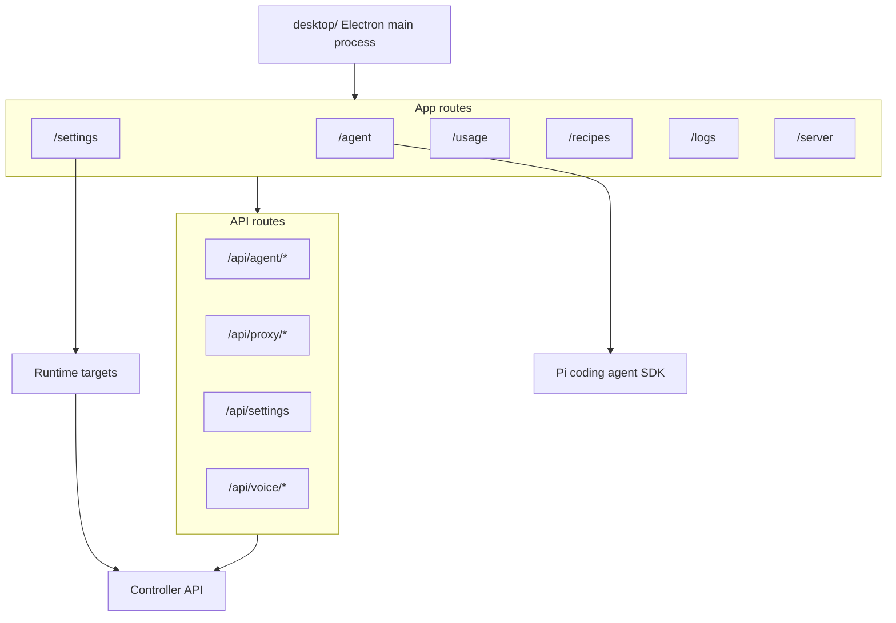

# Frontend

`frontend/` is the Next.js user interface for Local Studio and the source for the macOS Electron desktop app. It provides the agent workspace, controller settings, usage views, recipes, logs, setup screens, and browser-facing API routes.

## What It Does

- Renders the main web and desktop UI.
- Connects to one or more controllers.
- Hosts `/agent`, including session navigation, Pi agent integration, skills, extensions, terminal/browser panes, and local file surfaces.
- Surfaces controller runtime targets for vLLM, SGLang, llama.cpp, and MLX in Settings.
- Provides API routes that bridge the UI to controller and local desktop/runtime capabilities.
- Builds the Electron shell and production desktop artifacts.

## What Is In Use

- Next.js 16 App Router.
- React 19 and TypeScript.
- Tailwind CSS v4.
- Zustand state stores.
- `@earendil-works/pi-coding-agent` for the agent runtime.
- Electron and electron-builder for the desktop app.
- xterm.js for terminal UI.

## Architecture



## Prerequisites

- Node.js 20+.
- npm.
- A reachable controller for most runtime features. Defaults to `http://localhost:8080`.

## Common Commands

```bash
npm ci
npm run build
npm run start
npm run typecheck
npm run typecheck:desktop
npm run lint
npm run check:quality
```

Development server:

```bash
npm run dev
```

Only run the dev server when you intentionally want local interactive verification.

## Desktop App

```bash
npm run desktop:build:main
npm run desktop:start
npm run desktop:pack
npm run desktop:dist
```

- `desktop:pack` builds a local app bundle for quick installation.
- `desktop:dist` builds signed DMG/ZIP artifacts for release.
- The canonical installed app is `/Applications/Local Studio.app`.

## Controller Connection

Controller URL resolution is implemented in `src/lib/backend-config.ts`. Common environment variables are:

- `BACKEND_URL`
- `NEXT_PUBLIC_BACKEND_URL`
- `LOCAL_STUDIO_BACKEND_URL`

When no URL is configured, the frontend falls back to `http://localhost:8080`. Saved controller settings are managed through the app settings surface.

Settings also renders controller-provided runtime targets. The target rows come from `/runtime/targets` and include direct Python or binary targets for vLLM, SGLang, llama.cpp, and MLX when the controller can discover them.

## Where To Look

- `src/app/`: thin route shells (e.g. `src/app/agent/page.tsx`, `src/app/settings/page.tsx`) that delegate to feature modules in `src/features/*`.
- `src/features/agent/`: agent workspace runtime, messages, hooks, and UI.
- `src/app/api/agent/`: local agent/session/browser/runtime API routes.
- `src/app/api/proxy/`: controller proxy route.
- `src/features/settings/`: settings UI.
- `src/features/settings/engines-section.tsx` and `src/features/settings/engines-section-model.ts`: runtime target rows and settings models.
- `src/app/usage/`: usage UI.
- `src/lib/backend-config.ts`: controller URL selection.
- `src/ui/`: shared frontend UI primitives.
- `desktop/`: Electron main process and desktop build config.
